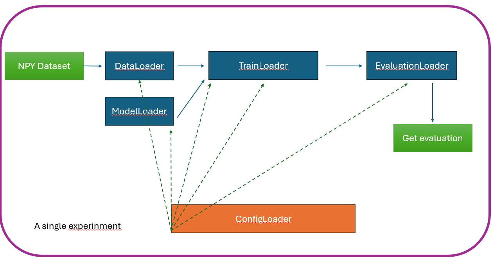
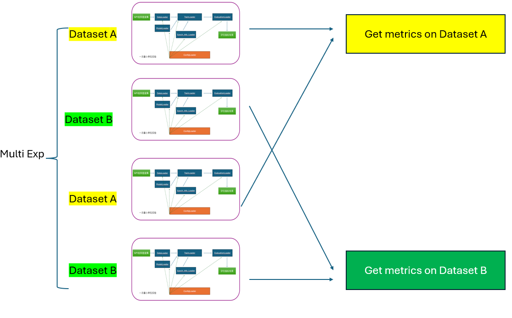

# Fault Diagnosis Benchmark Framework

An opinionated, configuration-driven framework for benchmarking fault diagnosis models across multiple datasets. The project ships with a modular pipeline (data loading, preprocessing, training, evaluation, logging) so you can focus on defining experiments in YAML and extending individual components only when necessary.

This README introduces the framework and provides a hands-on tutorial using `benchmark/configs/ExampleComplex.yaml` as the canonical reference.

---

## Table of Contents

- [Fault Diagnosis Benchmark Framework](#fault-diagnosis-benchmark-framework)
  - [Table of Contents](#table-of-contents)
  - [Quick Start](#quick-start)
  - [Key Flexibility Highlights](#key-flexibility-highlights)
  - [TODO](#todo)
  - [Configuration Walkthrough](#configuration-walkthrough)
    - [Global](#global)
    - [Datasets](#datasets)
    - [Models](#models)
    - [Experiments](#experiments)
    - [Training Templates](#training-templates)
    - [Evaluation Templates](#evaluation-templates)
  - [Running Experiments](#running-experiments)
  - [Interpreting Outputs](#interpreting-outputs)
  - [Extending the Framework](#extending-the-framework)
    - [Extending Datasets](#extending-datasets)
    - [Extending Preprocessors](#extending-preprocessors)
    - [Extending Models](#extending-models)
    - [Extending Trainers](#extending-trainers)
    - [Extending Evaluators](#extending-evaluators)
  - [Project Layout](#project-layout)

---

## Quick Start

```bash
conda create -n fault-benchmark python=3.10
conda activate fault-benchmark
pip install -r requirements.txt  # if provided, otherwise install torch, scikit-learn, matplotlib, numpy, pyyaml

cd benchmark
python main.py configs/ExampleComplex.yaml
```

The command above runs every experiment defined in `ExampleComplex.yaml`, writes logs to `benchmark/results/<config_name>/v*/`, and produces summaries plus Excel exports.

---

## Key Flexibility Highlights

- **Grid search & summarization control** – specify candidate values in model configs, then decide whether to keep all results or only the best per (model, dataset) group using per-experiment `summary` settings.
- **Customizable early stopping** – toggle `early_stop_use_monitor` to stop by validation loss or by your own monitor metric/split.
- **Best checkpoint selection** – `monitor` determines the metric/split used to track and save `best.pth`, so “best” matches your KPI.
- **Data fraction for rapid iteration** – set `data_fraction` to 0.1, 0.01, etc., to quickly sanity-check experiments without the full dataset.
- **Checkpoint retention policy** – choose between `checkpoint_policy: 'best'` (keep only the best checkpoint) or `'all'` (save every epoch).
- **Pre-test evaluator checks** – enable `global.pre_test` to sanity-check all evaluators (training-time and final) before the main run.
- **Monitor split flexibility** – monitors can evaluate on validation or test splits (`split: 'val'|'test'`) to suit exploratory or theoretical comparisons.
- **Grid search across models and training templates** – brace syntax (`"{a, b}"`, `{list}`) works for model hyperparameters and training template fields alike.
- **Monitor uses evaluator functions** – monitoring logic reuses the same evaluator signatures, so any metric available in evaluation templates can be used for best-ckpt tracking.
- **Structured logging & outputs** – each run creates a new versioned directory containing `run.log`, `debug.log`, `error.log`, per-experiment checkpoints/plots, two Excel summaries (grouped by dataset and by model), and a `timings.csv` with start/end times for profiling.

## TODO

- Add native sequence-to-sequence training/evaluation support (per-step labels, masks).
- Provide probability-aware evaluator hooks (e.g., AUC/PR using logits → probability adapters).
- Integrate additional state-of-the-art architectures out of the box.
- Support CSV-based dataset ingestion alongside `.npy` collections.

---



## Configuration Walkthrough

Every YAML file follows the structure below. The excerpts are taken directly from `benchmark/configs/ExampleComplex.yaml`.

```yaml
global:
  seed: 42
  deterministic: false
  device: 'cuda'
  checkpoint_policy: 'best'
  pre_test: true
  author: Benchmark
  date: '2025-10-16'
  description: Multi-model multi-dataset comparison experiment framework
  version: '3.0'

datasets:
  NPY_UCI_HAR:
    train_data: ./data/NPY_UCI_HAR/train_X.npy
    train_label: ./data/NPY_UCI_HAR/train_y.npy
    test_data: ./data/NPY_UCI_HAR/test_X.npy
    test_label: ./data/NPY_UCI_HAR/test_y.npy
    preprocessing:
      steps:
        - name: "normalize"
          file: "normalizers"
          function: "standard_normalize"
          params: {}
        - name: "add_noise"
          file: "noise_processors"
          function: "add_gaussian_noise"
          params: { noise_level: 0.01 }

models:
  LSTM:
    module: models/LSTM
    class: LSTM2one
    hidden_dim: "{64, 128}"
    num_layers: "{2, 3}"
    dropout: 0.2

experiments:
  - name: "LSTM_NPY_UCI_HAR"
    model: "LSTM"
    dataset: "NPY_UCI_HAR"
    training: "supervised_debug_with_metrics"
    evaluation: "default"
    summary:
      keep_only_best: true
      metric: accuracy
      mode: max
      split: test

training_templates:
  supervised_debug_with_metrics:
    type: supervised
    batch_size: 64
    epochs: 50
    lr: 0.001
    patience: 2
    optimizer: 'adam'
    print_interval: 1
    validation_split: 0.2
    early_stop_use_monitor: true
    epochinfo: 'train_acc'
    epochinfo_split: 'val'
    monitor:
      metric: 'accuracy'
      mode: 'max'
      split: 'val'

evaluation_templates:
  train_acc:
    accuracy:
      file: sklearn_metrics
      function: accuracy_evaluate
  default:
    f1: {}
    precision:
      file: sklearn_metrics
      function: precision_evaluate
    recall:
      file: sklearn_metrics
      function: recall_evaluate
    accuracy:
      file: sklearn_metrics
      function: accuracy_evaluate
    train_test_gap:
      file: sklearn_metrics
      function: train_test_gap_evaluate
    test_samples:
      file: plot_label_distribution
      function: evaluate
```

### Global

`global` defines runtime behavior:

- `seed`, `deterministic`: reproducibility settings pushed into Python/NumPy/PyTorch.
- `device`: training device (`cuda` or `cpu`).
- `checkpoint_policy`: `best` keeps only the best checkpoint (`best.pth`), `all` keeps every epoch.
- `pre_test`: if true, the framework runs a lightweight evaluator sanity check before training.
- Metadata fields (`author`, `description`, …) are copied into the run directory.

Optional experiment-level summary control is handled under each experiment (see [Experiments](#experiments)).

### Datasets

- A dataset can either be a single `.npy` quartet (`train_X.npy`, `train_y.npy`, `test_X.npy`, `test_y.npy`) or a collection directory (`collection_path`) containing multiple sub-datasets with the same quartet layout.
- `preprocessing.steps` list is optional. Each step is defined by `file`, `function`, and an optional `params` dict. The framework will import `preprocessors/<file>.py` and call the named function.
- For collections, each sub-directory that contains the quartet is automatically expanded into separate experiments.

### Models

- `module`: Python module path relative to `benchmark/` (e.g., `models/LSTM`).
- `class`: class name inside the module.
- Any additional key/value pairs are forwarded as keyword arguments to the class constructor.
- Strings wrapped in braces (e.g., `"{64, 128}"`) denote grid search candidates; the framework expands them automatically.

### Experiments

Each experiment combines a model, dataset (or dataset collection), training template, and evaluation template.

- `name`: output directory name under `benchmark/results/<config_name>/v*/`.
- `model`: key defined in the `models` section.
- `dataset` or `dataset_collection`: choose between a single dataset or automatic expansion of a collection.
- `training`: key referencing `training_templates`.
- `evaluation`: key referencing `evaluation_templates`.
- `summary` (optional): control how results are summarized/exported.
  - `keep_only_best`: when true, only the best experiment for each (model, dataset) pair is kept in summaries.
  - `metric`, `mode`, `split`: specify the metric and split (`test` or `val`) used to decide “best”.

### Training Templates

Re-usable training profiles consumed by the trainers.

- `type`: maps to files under `benchmark/trainers/` (e.g., `supervised` → `supervised_trainer.py`).
- Optimization parameters: `batch_size`, `epochs`, `lr`, `optimizer`, `patience`.
- Logging: `print_interval` controls how often epoch info is printed.
- Validation:
  - `validation_split`: fraction of training data reserved for validation. Must be specified (or set `use_test_as_val: true` explicitly).
  - `early_stop_use_monitor`: when true, early stopping follows the monitor metric instead of validation loss.
- Monitoring:
  - `epochinfo`: evaluation template used during training for logging/plots.
  - `epochinfo_split`: split used during training when logging (`val` recommended).
  - `monitor`: metric used to choose the best checkpoint. Includes `metric`, `mode` (`max`/`min`), and `split` (`val` or `test`).

### Evaluation Templates

Describe how metrics (and optional plots) are computed.

- Flattened dictionary format: each key is a metric name.
- `file` and `function` point to modules/functions under `benchmark/evaluators/`.
- Metrics returning numbers are stored in summaries; returning `(figure, value)` will save the figure automatically.
- You can define multiple templates (e.g., a lightweight `train_acc` for training-time logging and a comprehensive `default` for final evaluation).

---

## Running Experiments

```bash
cd benchmark
python main.py configs/ExampleComplex.yaml              # run all experiments defined in the file
python main.py configs/NASA_IMS.yaml --verbose          # optional verbose logging
```

During execution the framework will:

1. Validate the configuration.
2. Expand grid search combinations and dataset collections.
3. For each experiment:
   - Run optional pre-checks (if `pre_test: true`).
   - Load data, apply preprocessing steps.
   - Instantiate the model and trainer.
   - Train with early stopping/monitor logic.
   - Evaluate on the specified split(s) and save metrics/plots/checkpoints.
4. Summarize results and export Excel files (`results_by_dataset_*.xlsx`, `results_by_model_*.xlsx`).

---

## Interpreting Outputs

Each run produces `benchmark/results/<config_name>/vXX_<timestamp>/` containing:

- `run.log`: high-level progress (seed, experiments, metrics, warnings).
- `debug.log`: detailed logs (DEBUG level, evaluator traces, stack traces if any).
- `error.log`: aggregated experiment failures (if any).
- `timings.csv`: per-experiment timing summary.
- One sub-folder per experiment:
  - `plots/`: generated figures (training epoch info, final evaluation plots).
  - `checkpoints/`: saved checkpoints (`best.pth`, and optionally per-epoch `.pth` files if `checkpoint_policy='all'`).
  - `config.yaml`: snapshot of the YAML used.

---

## Extending the Framework

Most components live under `benchmark/`. The following guidelines show how to create your own datasets, preprocessors, models, trainers, and evaluators.

### Extending Datasets

**Single dataset**

1. Prepare four NumPy files: `train_X.npy`, `train_y.npy`, `test_X.npy`, `test_y.npy` (shape: `(samples, sequence_length, feature_dim)` for X, `(samples,)` or `(samples, sequence_length)` for y).
2. Place them under `benchmark/data/<your_dataset>/`.
3. Register in YAML:

   ```yaml
   datasets:
     MyDataset:
       train_data: ./data/MyDataset/train_X.npy
       train_label: ./data/MyDataset/train_y.npy
       test_data: ./data/MyDataset/test_X.npy
       test_label: ./data/MyDataset/test_y.npy
   ```

**Dataset collection**

1. Create a directory `./data/MyCollection/`.
2. Inside, create one sub-directory per dataset (`dataset_a`, `dataset_b`, …), each containing the quartet of `.npy` files.
3. Register in YAML:

   ```yaml
   datasets:
     MyCollection:
       collection_path: ./data/MyCollection
   ```

### Extending Preprocessors

1. Implement a function in `benchmark/preprocessors/<file>.py`:

   ```python
   def standard_normalize(data, params):
       mean = params.get('mean', data.mean(axis=0, keepdims=True))
       std = params.get('std', data.std(axis=0, keepdims=True) + 1e-6)
       return (data - mean) / std
   ```

2. Reference it in YAML:

   ```yaml
   preprocessing:
     steps:
       - name: "normalize"
         file: "normalizers"
         function: "standard_normalize"
         params:
           mean: null
           std: null
   ```

The function signature must be `(array, params_dict)` and return the transformed array.

### Extending Models

1. Create your model under `benchmark/models/<MyModel>.py`.
2. Expose a class whose constructor accepts `input_dim`, `output_dim`, plus any custom kwargs.
3. Register it in YAML:

   ```yaml
   models:
     MyModel:
       module: models/MyModel
       class: MyNet
       hidden_dim: 128
       num_layers: 3
   ```

Grid-search values can be supplied via string braces (`"{64, 128}"`).

### Extending Trainers

1. Place a new trainer in `benchmark/trainers/<my_trainer>.py`.
2. Inherit from `SupervisedTrainer` or build from scratch.
3. Update `training_templates` to point to it:

   ```yaml
   training_templates:
     my_custom_training:
       type: my_custom              # loads trainers/my_custom_trainer.py
       trainer_file: my_custom_trainer
       trainer_class: MyCustomTrainer
       ...
   ```

The loader will import `trainers/<trainer_file>.py` and instantiate `trainer_class`.

### Extending Evaluators

1. Create `benchmark/evaluators/<my_metric>.py` with a callable `evaluate` function:

   ```python
   def evaluate(X_train, y_train, y_train_pred, X_test, y_test, y_test_pred):
       return float(my_metric(y_test, y_test_pred))
   ```

2. Reference it in an evaluation template:

   ```yaml
   evaluation_templates:
     default:
       my_metric:
         file: my_metric
         function: evaluate
   ```

Evaluators can return:
- A number (stored as a metric).
- A string (logged as-is).
- A matplotlib Figure, or `(Figure, numeric_value)` tuple. Figures are saved automatically.

---

## Project Layout

```
benchmark/
├── main.py                  # CLI entry point
├── configs/                 # Experiment YAML files (ExampleComplex.yaml, etc.)
├── data/                    # Datasets (npy files or collections)
├── evaluators/              # Metric implementations
├── models/                  # Model definitions (LSTM, CNN, custom)
├── preprocessors/           # Data preprocessing steps
├── results/                 # Generated runs, logs, metrics, plots
├── src/                     # Loaders, managers, utilities
└── trainers/                # Training strategy implementations
```

---

Happy benchmarking! For questions or contributions, open an issue or submit a pull request keeping the modular philosophy in mind.


