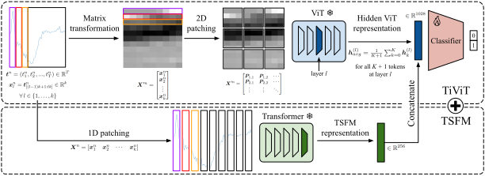

# TiViT: Time Series Representations for Classification Lie Hidden in Pretrained Vision Transformers

Authors: 
[Simon Roschmann](https://www.eml-munich.de/people/simon-roschmann), 
[Quentin Bouniot](https://qbouniot.github.io/), 
[Vasilii Feofanov](https://vfeofanov.github.io/), 
[Ievgen Redko](https://ievred.github.io/),
[Zeynep Akata](https://www.eml-munich.de/people/zeynep-akata)

[](https://arxiv.org/abs/2506.08641)

## Abstract

Time series classification is a fundamental task in healthcare and industry, yet the development of time series foundation models (TSFMs) remains limited by the scarcity of publicly available time series datasets. In this work, we propose **Ti**me **Vi**sion **T**ransformer (**TiViT**), a framework that converts time series into images to leverage the representational power of frozen Vision Transformers (ViTs) pretrained on large-scale image datasets. First, we theoretically motivate our approach by analyzing the 2D patching of ViTs for time series, showing that it can increase the number of label-relevant tokens and reduce the sample complexity. Second, we empirically demonstrate that TiViT achieves state-of-the-art performance on standard time series classification benchmarks by utilizing the hidden representations of large OpenCLIP models. We explore the structure of TiViT representations and find that intermediate layers with high intrinsic dimension are the most effective for time series classification. Finally, we assess the alignment between TiViT and TSFM representation spaces and identify a strong complementarity, with further performance gains achieved by combining their features. Our findings reveal a new direction for reusing vision representations in a non-visual domain.

## Methodology



Illustration of TiViT on a time series sample from [ECG200](https://www.timeseriesclassification.com/description.php?Dataset=ECG200). We split the time series into segments and stack them to form a grayscale image. Then, we patch the image in 2D and feed it into a frozen ViT pretrained on large-scale image datasets. We average the hidden representations from a specific layer and pass them to a learnable classification head. Combining the representations of TiViT and TSFMs such as Mantis further improves classification accuracy.

## Dependencies
This repository works with Python 3.11 and PyTorch 2.7. Please create a conda environment and install the dependencies specified in [`requirements.txt`](requirements.txt).
```bash
conda create -n tivit_env python=3.11
conda activate tivit_env
python -m pip install -r requirements.txt
```

## Datasets

We evaluate TiViT on the [UCR and UEA benchmark](https://www.timeseriesclassification.com/) for time series classification. The benchmark datasets can be loaded via the [aeon](https://www.aeon-toolkit.org) toolkit. For UCR datasets, we apply by default linear interpolation to handle missing values and use padding to accommodate unequal time series lengths. To use the preprocessing functionality provided by Aeon instead, add the `--aeon` flag.

## Models

### Time Vision Transformer (TiViT)

In our study, we evaluate TiViT with various ViT backbones, as summarized in the following table. These ViTs cover a wide range of pretraining paradigms and model sizes in the vision and vision-language domain.

| Model | Paper | Checkpoints |
|-|-|-|
| **CLIP** | [Radford et al., 2021](https://arxiv.org/abs/2103.00020); [Cherti et al., 2022](https://arxiv.org/abs/2212.07143) | [ViT-B-16](https://huggingface.co/laion/CLIP-ViT-B-16-laion2B-s34B-b88K), [ViT-B-32](https://huggingface.co/laion/CLIP-ViT-B-32-laion2B-s34B-b79K), [ViT-L-14](https://huggingface.co/laion/CLIP-ViT-L-14-laion2B-s32B-b82K), [ViT-H-14](https://huggingface.co/laion/CLIP-ViT-H-14-laion2B-s32B-b79K) |
| **SigLIP 2** | [Tschannen et al., 2025](https://arxiv.org/abs/2502.14786) | [SoViT-400m-14](https://huggingface.co/google/siglip2-so400m-patch14-224) |
| **DINOv2** | [Oquab et al., 2023](https://arxiv.org/abs/2304.07193) | [ViT-S-14](https://huggingface.co/facebook/dinov2-small), [ViT-B-14](https://huggingface.co/facebook/dinov2-base), [ViT-L-14](https://huggingface.co/facebook/dinov2-large) |
| **MAE** | [He et al., 2021](https://arxiv.org/abs/2111.06377) | [ViT-B-16](https://huggingface.co/facebook/vit-mae-base), [ViT-L-14](https://huggingface.co/facebook/vit-mae-large), [ViT-H-14](https://huggingface.co/facebook/vit-mae-huge) |


### Time Series Foundation Model (TSFM)

We compare and optionally fuse TiViT with two state-of-the-art TSFMs exclusively pretrained on time series.

- **Mantis** ([Paper](https://arxiv.org/abs/2502.15637), [Checkpoint](https://huggingface.co/paris-noah/Mantis-8M)): Transformer model (8 M parameters) pretrained on 2 million time series with contrastive learning
- **MOMENT** ([Paper](https://arxiv.org/abs/2402.03885), [Checkpoint](https://huggingface.co/AutonLab/MOMENT-1-base)): Transformer models pretrained on 13 million time series with masked modeling. There exist three different sizes: Small (40 M parameters), Base (125 M parameters), Large (385 M parameters).

## Classification

Below is an example command to perform classification with TiViT on the UCR benchmark using hidden representations from layer 14 of an OpenCLIP ViT-H model:

```bash
python main.py --vit_1_name laion/CLIP-ViT-H-14-laion2B-s32B-b79K --vit_1_layer 14 --aggregation mean --patch_size sqrt --stride 0.1 --classifier_type logistic_regression --datasets ucr --data_dir /path/to/your/data --result_dir /path/to/save/results --random_seed 2025
```

Check out [`arguments.py`](./src/arguments.py) for a comprehensive overview of all configurable parameters.
To further improve classification accuracy, we propose to concatenate the representations of TiViT and traditional TSFMs by adding:

- `--mantis`
- `--moment [small | base | large]`


The following table summarizes the linear classification accuracy of TiViT and TSFMs on the UCR and UEA benchmark.

| Model | UCR | UEA |
| - | - | - |
| Moment | 79.0 | 69.9 |
| Mantis | 80.1 | 72.4 |
| TiViT *(Ours)* | 81.3 | 72.0 |
| TiViT + Moment *(Ours)*  | 82.5 | 72.6 |
| TiViT + Mantis *(Ours)* | 83.0 | 73.7 |

## Intrinsic Dimension and Principal Components

To better understand the hidden representations of ViTs, we analyze how their structure evolves across layers. Use the following command to compute the intrinsic dimension of representations from CLIP ViT-H:

```bash
python main.py --vit_1_name laion/CLIP-ViT-H-14-laion2B-s32B-b79K --aggregation mean --patch_size sqrt --stride 0.1 --get_intrinsic_dimension --datasets ucr --data_dir /path/to/your/data --result_dir /path/to/save/results --random_seed 2025
```

Alternatively, you may compute the number of principal components necessary to cover 95\% of the variance in the representations by setting the flag `--get_principal_components`.

## Alignment

The alignment of representations from CLIP ViT-H (layer 14) and Mantis on the UCR benchmark can be measured using the mutual k-NN metric.

```bash
python main.py --vit_1_name laion/CLIP-ViT-H-14-laion2B-s32B-b79K --vit_1_layer 14 --aggregation mean --patch_size sqrt --stride 0.1 --mantis --measure_alignment --datasets ucr --data_dir /path/to/your/data --result_dir /path/to/save/results --random_seed 2025
```

You may specify different ViTs (`--vit_1_name`, `--vit_2_name`) and/or TSFMs (`--mantis`, `--moment`). Note that the alignment score can only be computed between two models at a time.

## Acknowledgments

We appreciate the following repositories for their valuable code:
- [The Platonic Representation Hypothesis](https://github.com/minyoungg/platonic-rep/): for assessing model alignment via the mutual k-NN metric
- [DADApy](https://github.com/sissa-data-science/DADApy): for computing the intrinsic dimension of representations

## Citation
If you find TiViT useful, please star this repository and cite our work:

```bibtex
@article{roschmann2025tivit,
  title={Time Series Representations for Classification Lie Hidden in Pretrained Vision Transformers},
  author={Simon Roschmann and Quentin Bouniot and Vasilii Feofanov and Ievgen Redko and Zeynep Akata},
  journal={arXiv preprint arXiv:2506.08641},
  year={2025}
}
```

## Contact

If you have any questions, feel free to contact us: simon.roschmann@tum.de